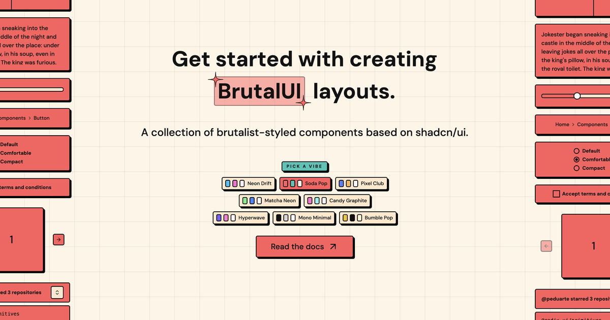

# BrutalUI

[https://brutalui.dev](https://brutalui.dev)

<a href="https://brutalui.dev/docs">
  
</a>

## Introduction

BrutalUI is a collection of brutalist-styled components based on shadcn/ui. 

## What you get

- 70+ shadcn/ui components with brutalist styling
- Themeable tokens + multiple vibes
- Copy/paste workflow or shadcn registry install
- Next.js + React 19 ready

## Quick start (usage)

1) Start with a Tailwind + React app (Next.js or Vite).
2) Initialize shadcn:

```bash
npx shadcn@latest init
```

3) Add components:

```bash
npx shadcn@latest add https://brutalui.dev/r/button.json
```

Or copy/paste directly from the docs.

## Usage (copy/paste)

Grab the component from the docs and paste it into your project.

```tsx
import { Button } from "@/components/ui/button"

export default function Example() {
  return <Button>Brutal Button</Button>
}
```

## Usage (shadcn registry)

```bash
npx shadcn@latest add https://brutalui.dev/r/button.json
```

## Examples

Accordion:

```tsx
import {
  Accordion,
  AccordionContent,
  AccordionItem,
  AccordionTrigger,
} from "@/components/ui/accordion"

export default function Example() {
  return (
    <Accordion type="single" collapsible>
      <AccordionItem value="item-1">
        <AccordionTrigger>Is it accessible?</AccordionTrigger>
        <AccordionContent>
          Yes. It adheres to the WAI-ARIA design pattern.
        </AccordionContent>
      </AccordionItem>
    </Accordion>
  )
}
```

Card:

```tsx
import { Card, CardContent, CardHeader, CardTitle } from "@/components/ui/card"

export default function Example() {
  return (
    <Card>
      <CardHeader>
        <CardTitle>BrutalUI Card</CardTitle>
      </CardHeader>
      <CardContent>Sharp edges. Loud shadows.</CardContent>
    </Card>
  )
}
```

## Registry deployment

If you update components, regenerate the registry files:

```bash
npm run registry:generate
npm run registry:build
```

## Documentation

Visit [docs](https://brutalui.dev/docs) to get started.

## About 

I created this collection of components for people who want to learn more about brutalist style and to help them get started with creating brutalist layouts.

## License

[MIT](https://github.com/suyesh/brutal-ui/blob/main/LICENSE)

Inspired by [neobrutalism-components](https://github.com/ekmas/neobrutalism-components).
